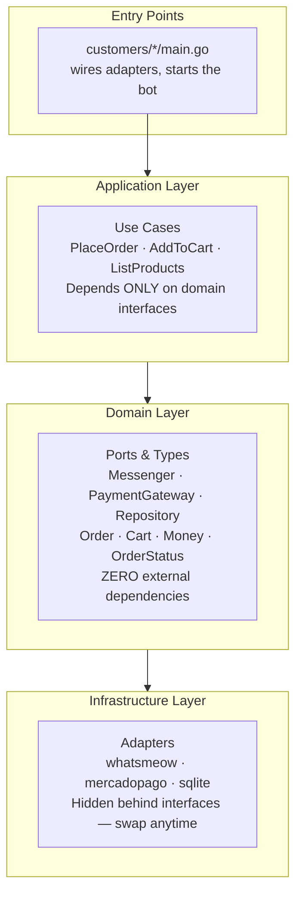

# ViaBot Core SDK

[](https://go.dev/doc/devel/release)
[](LICENSE)
[](https://pkg.go.dev/viabot.stream/sdk)

**ViaBot** is a multi-domain chatbot platform built with **Hexagonal Architecture (Ports & Adapters)** and **Domain-Driven Design (DDD)**. This repository contains the public Core SDK (`viabot.stream/sdk`) — the reusable domain and application layer shared across all ViaBot deployments.

> **Status:** MVP — WhatsApp e-commerce with Pix and Boleto payments (Brazilian market).

---

## Architecture



### Why Hexagonal + DDD?

| Requirement | Solution |
| ----------- | -------- |
| **Multi-channel** (WhatsApp → Telegram → Email) | Each channel = new Adapter, same `Messenger` Port |
| **Multi-gateway** (Mercado Pago → Stripe) | Each gateway = new Adapter, same `PaymentGateway` Port |
| **Multi-database** (SQLite dev → pgx prod) | Each database = new Adapter, same `Repository` Port |
| **Testability** | Domain logic depends on interfaces — mock adapters in unit tests |
| **Complex domains** (e-commerce, finance, mentor IA) | DDD Aggregates, Value Objects, Bounded Contexts |

---

## Public SDK — `viabot.stream/sdk`

The SDK is the single import point for client applications. It exposes:

### Domain Ports (Interfaces)

```go
// Bidirectional message exchange (WhatsApp, Telegram, etc.)
type Messenger interface { ... }

// Segregated send/receive (ISP compliance)
type MessageSender interface { Send(...) }
type MessageReceiver interface { Receive(...) }

// Payment processing (Mercado Pago, Stripe, etc.)
type PaymentGateway interface {
    CreatePayment(ctx, order) (*Payment, error)
    GetPaymentStatus(ctx, paymentID) (PaymentStatus, error)
    HandleWebhook(ctx, payload) (*WebhookEvent, error)
}

// Data persistence
type OrderRepository interface { Save, FindByID, FindByCustomer, ... }
type ProductRepository interface { Save, FindByID, FindAll, ... }
type CartRepository interface { Save, FindByCustomer, Delete }
type CustomerRepository interface { Save, FindByID, FindByPhone }
```

### Domain Entities & Value Objects

| Type | Category | Purpose |
| ---- | -------- | ------- |
| `Order` | Aggregate Root | Purchase lifecycle (pending → confirmed → shipped → delivered) |
| `Cart` | Aggregate Root | Temporary item collection (24h expiry) |
| `Customer` | Entity | Person interacting via WhatsApp |
| `Product` | Entity | Item available for purchase |
| `Money` | Value Object | Amount in cents + currency with validation |
| `OrderStatus` | Value Object | Finite state machine with valid transitions |
| `Payment` | Value Object | Gateway transaction details (Pix QR, boleto barcode) |

### Application Services

```go
// Use cases — inject via constructor (DIP)
orderService := application.NewOrderService(orderRepo, cartRepo, paymentGateway)
cartService := application.NewCartService(cartRepo, productRepo)
productService := application.NewProductService(productRepo)

// Place an order
order, err := orderService.PlaceOrder(ctx, customerID, cartID)

// Confirm via webhook
err := orderService.HandlePaymentWebhook(ctx, webhookPayload)

// Browse catalog
products, err := productService.ListProducts(ctx)
```

### Factory Functions

```go
import "viabot.stream/sdk"

// Database
db, err := sdk.OpenDatabase(sdk.DefaultDatabaseDSN())
sdk.RunMigrations(db)

// Repositories (returns domain interface, not concrete type — DIP)
customerRepo := sdk.NewCustomerRepository(db)
productRepo := sdk.NewProductRepository(db)
cartRepo := sdk.NewCartRepository(db)
orderRepo := sdk.NewOrderRepository(db)

// Payment gateway
gateway, err := sdk.NewMercadoPagoGateway(os.Getenv("MP_ACCESS_TOKEN"))
```

---

## Getting Started

### Prerequisites

- [Go 1.22+](https://go.dev/dl/)
- C compiler (`gcc`, `clang`, etc.) — required by SQLite (`CGO_ENABLED=1`)

### Clone

```bash
git clone --recurse-submodules https://github.com/DJFCoder/viabot.git
cd viabot

# Build SDK
CGO_ENABLED=1 go build ./core/...

# Run tests
CGO_ENABLED=1 go test ./core/...
```

### Run a Customer Entry Point

Tenant-specific deployments live in a [private submodule](https://github.com/DJFCoder/viabot-customers):

```bash
cd customers/customer-a
CGO_ENABLED=1 go run main.go
```

---

## Development

### Workspace

The `go.work` file joins the SDK with local customer entry points:

```bash
go work init
go work use ./core ./customers/customer-a
```

### Internal Packages

Adapters live under `core/internal/` and are **not importable** from outside the module. The public SDK surface is limited to:

| Package | Import Path | Visibility |
| ------- | ----------- | ---------- |
| Domain | `viabot.stream/sdk/domain` | Public |
| Application | `viabot.stream/sdk/application` | Public |
| SDK factories | `viabot.stream/sdk` | Public |
| Adapters | `viabot.stream/sdk/internal/*` | Internal (Go enforce) |

---

## Design Principles

| Rule | Practice |
| ---- | -------- |
| **No `else` keyword** | Guard clauses and early returns everywhere |
| **Value Objects** | `Money`, `OrderStatus`, `PhoneNumber` — never raw primitives |
| **First-Class Collections** | `OrderItemCollection`, `CartItemCollection` |
| **≤2 instance variables** | Composition via extracted types (`orderDetails`, `customerProfile`) |
| **No public setters** | Behavior methods + private constructors + static factories |
| **Dependency Inversion** | Constructor injection of interfaces only |
| **Interface Segregation** | `MessageSender` ≠ `MessageReceiver` |
| **Fail Fast** | Validate at method entry, return sentinel errors |

---

## Roadmap

| Phase | Features |
| ----- | -------- |
| **MVP** (current) | WhatsApp e-commerce, Pix/Boleto payments, SQLite |
| **Phase 2** | Card payments, Stripe, PostgreSQL (pgx), Telegram, Admin React UI |
| **Phase 3+** | Finance domain (invoices, subscriptions), Mentor IA, Marketplace |

---

## License

MIT
